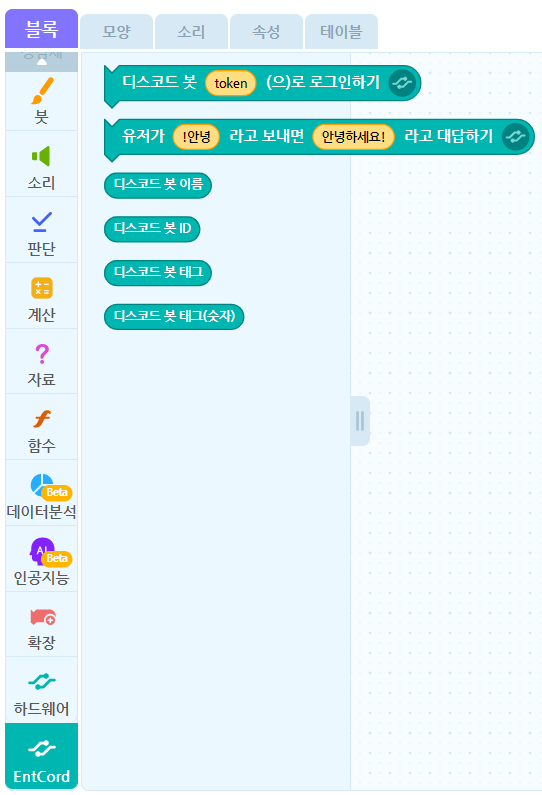

# EntCord

**EntCord**란?

* [엔트리](https://playentry.org/)에서 [Discord](https://discordapp.com/) Bot 을 작동시킬 수 있는 기능입니다.

현재는 베타라서 오류가 많을 수 있습니다.

## 사용법

[엔트리 작품 만들기](https://playentry.org/ws#!/)에 들어가 개발자 도구(F12 or Ctrl + Shift + I) 콘솔에

```js
$.get("https://raw.githack.com/ditto7890/EntCord/master/block.js")
```

라고 입력해주시면 됩니다.

## 결과


