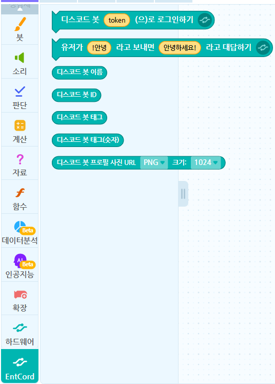

# EntCord

**EntCord**란?

* [엔트리](https://playentry.org/)에서 [Discord](https://discordapp.com/) Bot 을 작동시킬 수 있는 기능입니다.

현재는 베타라서 오류가 많을 수 있습니다.

## 사용법

[엔트리 작품 만들기](https://playentry.org/ws#!/)에 들어가 개발자 도구(F12 or Ctrl + Shift + I) 콘솔에

```js
$.get("https://raw.githack.com/ditto7890/EntCord/master/block.js")
```

라고 입력해주시면 됩니다.

## 결과



## 업데이트

1.0.2 - 대규모 업데이트 예정

1.0.12 - 악용 방지 테스트, .gitignore 추가, 코드를 불러왔을 때 콘솔 메세지 추가, 결과 이미지 수정

1.0.11 - 색깔 변경, 상태메세지 설정 삭제

1.0.1 - 디스코드 봇에 관한 블럭 다량 추가

1.0.0 - EntCord 베타 출시(로그인, 상태메세지 설정)
